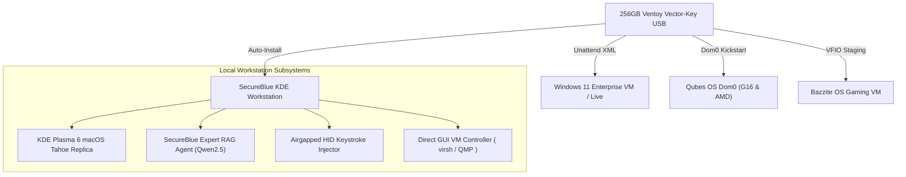

# SecureBlue KDE Agentic Deploy & Project Vector-Key

[](https://github.com/secureblue/secureblue)
[](https://fedoraproject.org/kinoite/)
[](https://www.ventoy.net)
[](https://bazzite.gg)
[](LICENSE)

An enterprise-grade, agentic deployment framework for **SecureBlue Kinoite KDE Plasma 6** workstations, featuring **Project Vector-Key (256GB Hybrid Multiboot & Offline AI Rescue USB)**, **Automated Kickstart & Unattend Answer Files**, **Secondary RTX 4080 VFIO Hardware Passthrough**, and **Direct GUI VM Control**.

---

## 🏗️ Architecture Overview



---

## 📚 Master Documentation Index

| Document / Runbook | Description |
| :--- | :--- |
| 📖 [HUMAN_LOGIC_KONSOLE_ASSEMBLY_GUIDE.md](.assets/docs/HUMAN_LOGIC_KONSOLE_ASSEMBLY_GUIDE.md) | **Human Logic**: 100% copy-pasteable line-by-line manual terminal command sequence to assemble and customize the entire workstation without black-box scripts. |
| ⚡ [PROJECT_VECTOR_KEY_MANIFEST.md](.assets/docs/PROJECT_VECTOR_KEY_MANIFEST.md) | Complete specification for the 256GB Ventoy-Plus Multiboot USB, Kickstart templates, and zero-touch log harvester. |
| 🍎 [MACOS_TAHOE_PLASMA6_RUNBOOK.md](.assets/docs/MACOS_TAHOE_PLASMA6_RUNBOOK.md) | macOS Tahoe Plasma 6 visual replica runbook, widget gap optimizer, and cosmetic reset service. |
| 🎮 [BAZZITE_VFIO_QUIRKS_AND_HARDWARE_PASSTHROUGH.md](.assets/docs/BAZZITE_VFIO_QUIRKS_AND_HARDWARE_PASSTHROUGH.md) | AMD 7800X3D SVM/IOMMU setup, RTX 4080 dynamic VFIO unbinding, and libvirt XML configuration. |
| 🔑 [credentials.md](credentials.md) | Staged session tokens and API credentials (GitHub PAT, Gemini, Kimi). |

---

## 🚀 Key Tooling & Command Reference

### 1. Provision 256GB Vector-Key USB
Format and provision a target 256GB USB drive (e.g. `/dev/sdb`) with Ventoy GPT mode and Vector-Key answer files:
```bash
sudo bash .backend/files/ventoy-vector-key/install_vector_key_to_usb.sh /dev/sdb
```

### 2. Query Offline SecureBlue KDE Expert RAG Agent
Search the offline knowledge engine for any CLI command, SELinux policy syntax, or kernel argument:
```bash
python3 .backend/files/ventoy-vector-key/rescue-engine/bin/secureblue_expert_agent.py "rpm-ostree kargs and selinux"
```

### 3. Direct GUI VM Controller (Mouse & Keyboard Control)
Inject keystrokes, send text payloads, or capture framebuffer screenshots from running `qubes-vm` or `bazzite-gaming` VMs:
```bash
python3 .backend/files/ventoy-vector-key/rescue-engine/bin/gui_vm_controller.py --domain qubes-vm --send-keys "KEY_ENTER" --screenshot /var/roothome/qubes_live.png
```

### 4. Airgapped HID Keystroke Injector
Inject command payloads over `/dev/hidg0` (USB Gadget HID keyboard) into airgapped target machines:
```bash
bash .backend/files/ventoy-vector-key/rescue-engine/bin/otp_keystroke_injector.sh "systemctl reboot" 120
```

---

## 🔐 Security & Hardening Architecture

- **Root of Trust**: Hardened atomic OCI container image builds with read-only `/usr` sysroot.
- **SELinux Enforced**: Custom Type Enforcement (`antigravity_agent.te`) compiled policies for unconfined agent execution.
- **Crypto Purge**: Post-reboot automated cleanup of crypto miners, folding services, and unprivileged user namespace containers (`post-reboot-crypto-purge.sh`).

---

## 📜 License
Licensed under the [MIT License](LICENSE).
