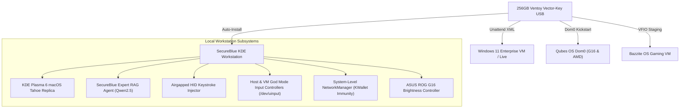

# SecureBlue KDE Agentic Deploy & Project Vector-Key

[](https://github.com/secureblue/secureblue)
[](https://fedoraproject.org/kinoite/)
[](https://www.ventoy.net)
[](https://bazzite.gg)
[](LICENSE)

An enterprise-grade, agentic deployment framework for **SecureBlue Kinoite KDE Plasma 6** workstations, featuring **Project Vector-Key (256GB Hybrid Multiboot & Offline AI Rescue USB)**, **Automated Kickstart & Unattend Answer Files**, **Secondary RTX 4080 VFIO Hardware Passthrough**, **Permanent Network Authentication Repair**, **Host & VM "God Mode" Screen Control**, and **ASUS ROG Zephyrus G16 Screen Brightness Repair**.

---

## 🏗️ Architecture Overview



---

## 📚 Master Documentation Index

| Document / Runbook | Description |
| :--- | :--- |
| 🌐 [DEEP_RESEARCH_NETWORK_AUTHENTICATION_AND_GOD_MODE_RUNBOOK.md](.assets/docs/DEEP_RESEARCH_NETWORK_AUTHENTICATION_AND_GOD_MODE_RUNBOOK.md) | **Network Repair & God Mode**: Deep research root cause analysis, KWallet obliteration script, Tailscale-Mullvad split tunnel override, and Host God Mode uinput controller. |
| ☀️ [ASUS_ROG_G16_SCREEN_BRIGHTNESS_RUNBOOK.md](.assets/docs/ASUS_ROG_G16_SCREEN_BRIGHTNESS_RUNBOOK.md) | **ASUS ROG G16 Brightness Repair**: Modprobe registry dwords, ACPI native backlight kargs, and sysfs udev permissions. |
| 📖 [HUMAN_LOGIC_KONSOLE_ASSEMBLY_GUIDE.md](.assets/docs/HUMAN_LOGIC_KONSOLE_ASSEMBLY_GUIDE.md) | **Human Logic**: 100% copy-pasteable line-by-line manual terminal command sequence to assemble and customize the entire workstation without black-box scripts. |
| ⚡ [PROJECT_VECTOR_KEY_MANIFEST.md](.assets/docs/PROJECT_VECTOR_KEY_MANIFEST.md) | Complete specification for the 256GB Ventoy-Plus Multiboot USB, Kickstart templates, and zero-touch log harvester. |
| 🍎 [MACOS_TAHOE_PLASMA6_RUNBOOK.md](.assets/docs/MACOS_TAHOE_PLASMA6_RUNBOOK.md) | macOS Tahoe Plasma 6 visual replica runbook, widget gap optimizer, and cosmetic reset service. |
| 🎮 [BAZZITE_VFIO_QUIRKS_AND_HARDWARE_PASSTHROUGH.md](.assets/docs/BAZZITE_VFIO_QUIRKS_AND_HARDWARE_PASSTHROUGH.md) | AMD 7800X3D SVM/IOMMU setup, RTX 4080 dynamic VFIO unbinding, and libvirt XML configuration. |
| 🔑 [credentials.md](credentials.md) | Staged session tokens and API credentials (GitHub PAT, Gemini, Kimi). |

---

## 🚀 Key Tooling & Command Reference

### 1. ASUS ROG Zephyrus G16 Screen Brightness Repair
Automated fix for G16 OLED/Mini-LED panel brightness control:
```bash
sudo bash .backend/files/ventoy-vector-key/rescue-engine/bin/fix_g16_screen_brightness.sh
```

### 2. Host OS "God Mode" Screen & Input Controller
Synthesize mouse clicks, movements, or keystrokes natively on Wayland / Host OS using `/dev/uinput`:
```bash
./.backend/files/ventoy-vector-key/rescue-engine/bin/host_god_screen_controller --move 50 50 --click
```

### 3. Obliterate KDE Wallet & Enforce System Connections
Decouple NetworkManager from KWallet and apply system-level password storage:
```bash
sudo bash .backend/files/ventoy-vector-key/rescue-engine/bin/obliterate_kde_wallet.sh agent-42
```

### 4. Direct GUI VM Controller (QEMU / KVM VMs)
Inject keystrokes, send text payloads, or capture framebuffer screenshots from running `qubes-vm` or `bazzite-gaming` VMs:
```bash
python3 .backend/files/ventoy-vector-key/rescue-engine/bin/gui_vm_controller.py --domain qubes-vm --send-keys "KEY_ENTER" --screenshot /var/roothome/qubes_live.png
```

### 5. Query Offline SecureBlue KDE Expert RAG Agent
Search the offline knowledge engine for any CLI command, SELinux policy syntax, or kernel argument:
```bash
python3 .backend/files/ventoy-vector-key/rescue-engine/bin/secureblue_expert_agent.py "rpm-ostree kargs and selinux"
```

---

## 🔐 Security & Hardening Architecture

- **Root of Trust**: Hardened atomic OCI container image builds with read-only `/usr` sysroot.
- **SELinux Enforced**: Custom Type Enforcement (`antigravity_agent.te` & `antigravity_kwin_mcp.te`) compiled modules for unconfined agent execution and KWin EIS D-Bus interaction.
- **Crypto Purge**: Post-reboot automated cleanup of crypto miners, folding services, and unprivileged user namespace containers (`post-reboot-crypto-purge.sh`).

---

## 📜 License
Licensed under the [MIT License](LICENSE).
